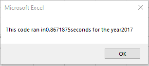
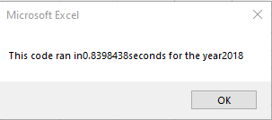
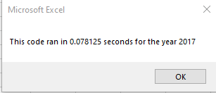
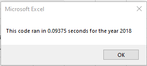

# Stock Analysis Code Refactor

## Project Overview

Using VBA, a script was written to analyze a specific stock and it was later expanded to analyze an entire dataset of stocks for years 2017 and 2018.  In order for the code to operate more efficiently for a larger dataset, the original code was refactored and it's performance was compared against the original code's performance.

### Purpose

The purpose of the project was to refactor existing code with the objective of increasing it's performance when utilized against a larger dataset.

## Results

### Original Code
In the original script, only one array was created with the purpose of storing tickers of the stocks within the given dataset. Then through the usage of nested loops, the code would go through each ticker to calculate it's total volume, starting price, ending price, and then output the results in the designated cells.

```
'loop thru tickers
    
    For i = 0 To 11
    
        ticker = tickers(i)
        totalVolume = 0
        
        Worksheets(yearValue).Activate
        
        'loop through rows in the data
        For j = 2 To RowCount
        
            'Get total volume for current ticker
            If Cells(j, 1).Value = ticker Then
            totalVolume = totalVolume + Cells(j, 8).Value
            
            End If
        
            'get starting price for current ticker
            If Cells(j, 1).Value = ticker And Cells(j - 1, 1).Value <> ticker Then
                startingPrice = Cells(j, 6).Value
                
            End If
        
            'get ending price for current ticker
            If Cells(j, 1).Value = ticker And Cells(j + 1, 1).Value <> ticker Then
                endingPrice = Cells(j, 6).Value
                
            End If
                    
            
        Next j
        
        'Output data for current ticker
        Worksheets("All Stocks Analysis").Activate
            
        Cells(4 + i, 1).Value = ticker
        Cells(4 + i, 2).Value = totalVolume
        Cells(4 + i, 3).Value = endingPrice / startingPrice - 1
        
        
    Next i
```
Once the script is done iterating through each ticker and printing the outputs, the code then calls another subroutine to format the resulting output sheet.

```
    'Call formating macro to format output sheet
    Call formatAllStocksAnalysisTable
```

The original code for 2017 ran in .867 seconds.


The original code for 2018 ran in .84 seconds.


### Refactored Code

One of the greatest differences made to the refactored code was the utilization of arrays.  Three additional output arrays were created: Ticker Volumes, Ticker Starting Prices, and Ticker Ending Prices.  A variable for the ticker index was created and used to access the appropriate data across the four arrays.  This methodology eliminated the nested loop in the original code that calculated and wrote the outputs for each tickers one by one before moving on to the next ticker. 

```
   '1a) Create a ticker Index
    Dim tickerIndex As Integer
    tickerIndex = 0
    
    '1b) Create three output arrays
    Dim tickerVolumes(11) As Long
    Dim tickerStartingPrices(11) As Single
    Dim tickerEndingPrices(11) As Single
        
    ''2a) Create a for loop to initialize the tickerVolumes to zero.
    For i = 0 To 11
        tickerVolumes(i) = 0
    
    Next i
     
        
    ''2b) Loop over all the rows in the spreadsheet.
    For Row = 2 To RowCount
    
        '3a) Increase volume for current ticker
        tickerVolumes(tickerIndex) = tickerVolumes(tickerIndex) + Cells(Row, 8).Value
        
        '3b) Check if the current row is the first row with the selected tickerIndex.
        If Cells(Row - 1, 1).Value <> tickers(tickerIndex) Then
        
            tickerStartingPrices(tickerIndex) = Cells(Row, 6).Value
            
        End If
        
        '3c) check if the current row is the last row with the selected ticker
         'If the next row’s ticker doesn’t match, increase the tickerIndex.
        If Cells(Row + 1, 1).Value <> tickers(tickerIndex) Then
        
            tickerEndingPrices(tickerIndex) = Cells(Row, 6).Value
            

            '3d Increase the tickerIndex.
            tickerIndex = tickerIndex + 1
            
        End If
    
    Next Row
```
Now with the establishment of the four arrays, we were able to loop through the arrays to produce the output onto the sheet.

```
    'Activate output worksheet
    Worksheets("All Stocks Analysis").Activate
    
    '4) Loop through your arrays to output the Ticker, Total Daily Volume, and Return.
    For i = 0 To 11
        Cells(4 + i, 1).Value = tickers(i)
        Cells(4 + i, 2).Value = tickerVolumes(i)
        Cells(4 + i, 3).Value = tickerEndingPrices(i) / tickerStartingPrices(i) - 1
```
With the output sheet now populated by accessing the arrays using the ticker index, the formatting code was added next rather than calling a different subroutine.

The changes to the code yielded positive results in the performance.  An analysis for 2017 stocks now runs in .078 seconds.



An analysis for 2018 stocks now runs in .094 seconds.


## Summary

Refactoring code holds several advantages.  One obvious advantage is the ability to improve upon on quickly the code executes the desired outputs.  By improving upon the efficiency of the code and freeing up computing resources, it aids in being able to handle even larger datasets in the future.  Another advantage of refactoring code is the increases the understanding of the software.  Other advantages include it helps in finding bugs/errors and allows us to improve code readability.

A big disadvantage in refactoring code is the time involved to do it.  As with the introduction of any new code or functionality, it can also introduce new bugs in the code.

With the refactoring of the stocks analysis VBA script, it definitely benefited by the improved performance times.  In addition, I gained a greater grasp of the code and what it was doing and took the opportunity to improve upon the comments within the code itself. I also found an error in the VBA code that I was able to correct.  The refactored code that was given had an index of 12 for the tickers.  This would be accurate for Python code, however, in VBA the ticker index should be 11 to declare 12 elements.  Refactoring the code definitely took more time than the writing the original code.  However, the advantages outweighed the disadvantages in this case.
